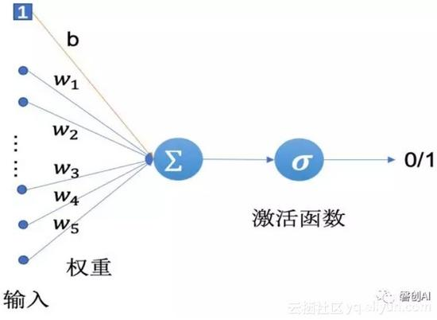
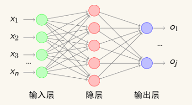
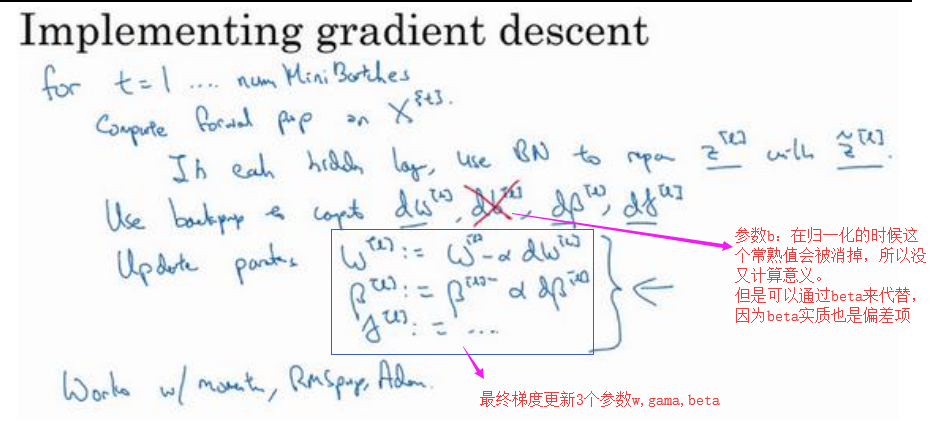

### 任务5：

1. 前馈神经网络、网络层数、输入层、隐藏层、输出层、隐藏单元、激活函数的概念。
2. 感知机相关；利用tensorflow等工具定义简单的几层网络（激活函数sigmoid），递归使用链式法则来实现反向传播。
3. 激活函数的种类以及各自的提出背景、优缺点。（和线性模型对比，线性模型的局限性，去线性化）
4. 深度学习中的正则化（参数范数惩罚：L1正则化、L2正则化；数据集增强；噪声添加；early stop；Dropout层）、正则化的介绍。
5. 深度模型中的优化：参数初始化策略；自适应学习率算法（梯度下降、AdaGrad、RMSProp、Adam；优化算法的选择）；batch norm层（提出背景、解决什么问题、层在训练和测试阶段的计算公式）；layer norm层。

1、前馈神经网络（feedforward neural network）：

​	简称[前馈](https://baike.baidu.com/item/%E5%89%8D%E9%A6%88/141922)网络，是[人工神经网络](https://baike.baidu.com/item/%E4%BA%BA%E5%B7%A5%E7%A5%9E%E7%BB%8F%E7%BD%91%E7%BB%9C/382460)的一种。在此种神经网络中，各神经元从输入层开始，接收前一级输入，并输出到下一级，直至[输出层](https://baike.baidu.com/item/%E8%BE%93%E5%87%BA%E5%B1%82/7202179)。整个网络中无反馈，可用一个有向无环图表示。

​	单层前馈神经网络：感知机模型

​	感知器对输入进行加权求和，然后通过**激活函数**，最终得到输出 ：

​						$$\begin{align}Z=w_1x_1+w_2x_2+...+w_mx_m +b\\y= f(Z)\end{align}$$

2、多层神经网路结构：

### 3、激活函数：

​	通常对前一层网络进行了加权求和 **z** 后，都需要进行非线性激活函数运算得到 **a**。其目的可以说为了去线性化，使得网络可以获得更有趣的结果。

​	若激活函数采用线性激活函数（恒等激励函数, 即**a**=**z** ），本质上就只是把输入线性组合再输出：

当然，若是输出问题是个回归问题，那么输出层可以尝试使用线性激活函数(等价于没用激活函数)

| 激活函数         | 公式                                       | 导数                                                         |
| ---------------- | ------------------------------------------ | ------------------------------------------------------------ |
| **sigmoid** 函数 | $a=\sigma(z)=\dfrac{1}{1+e^{-z}}$          | $\dfrac{d}{dz}\sigma(z)=\sigma(z)(1-\sigma(z))$              |
| **tanh** 函数    | $a=tanh(z)=\dfrac{e^z-e^{-z}}{e^z+e^{-z}}$ | $\dfrac{d}{dz}tanh(z)=1-(tanh(z))^2$，$注：g=\begin{cases}0 &z=10,-10\\1 &z=0\end{cases}$ |
| **ReLU** 函数    | $a=relu(z)=max(0,z)$                       | $g(z)^{’}=\begin{cases}0&if\ \ z<0\\1&if\ \ z>0\\undefined&if\ \ z=0\end{cases}$ |
| **Leaky ReLU**   | $a=leaky\_relu(z)=max(0.01z,z)$            | $g(z)^{’}=\begin{cases}0.01&if\ \ z<0\\1&if\ \ z>0\\undefined&if\ \ z=0\end{cases}$ |

使用场景：

​	sigmoid激活函数：再隐藏层基本不用，只有在最后进行输出二分类的时候才用。

​	tanh 激活函数： 优秀，几乎适合大部分场合(但是要注意梯度消失问题)，值域为[-1,1]。

​	relu 激活函数：经常使用，在不确定隐藏层用什么激活函数的时候，可以默认采用RELU。

relu的优点：

​	1、z为负数的时候导数为0

​	2、在**z**的去间变动很大的情况下，激活函数的导数 都会远大于0。实践中，使用relu激活函数的网络通常比使用sigmoid或tanh激活函数要快(sigmoid,tanh要浮点运算)。

​	3、sigmoid和tanh在正负饱和区梯度都会接近于0，造成了梯度弥散现象。而RELU不会，当然，当relu进入负半区时，梯度为0，神经元不会再训练(产生所谓稀疏性，梯度为0。leaky_relu不会如此)

### 4、神经网络中的正则化：

正则化能够帮助减少过拟合的现象，下面为深度学习常用的正则化方式：

原始问题： $min_{w,b}\ J(w,b)$   最小化代价函数 J(w,b)

其中： $LOSS = \dfrac{1}{m}\sum^m_il(\hat{y},y)$ 表示所有样本的总损失均值， $l(\hat{y},y)$为损失函数。

1、L1正则化： $J(w,b)= LOSS + \dfrac{\lambda}{2m}\sum^m_i|w|​$ 

2、L2正则化：$J(w,b)= LOSS + \dfrac{\lambda}{2m}\sum^m_i\|w\|^2$

3、Dropout：原理很简单，就是在全连接层中，去掉一部分连接，不参与计算。

4、增强数据：对于图片数据集，我们可以通过平移、旋转、缩放等手段增加额外的可训练数据集。

5、早期停止：在训练的过程中，发现在验证集上的测试精度反而越来越差时，提前停止训练

### 5、模型优化

1、权重w的初始化：

​	若使用tanh激活函数，可初始化为：$w^{[l]} = np.random.rand(shape)*\sqrt{\dfrac{1}{n^{[l-1]}}}$ 

​	若使用tanh激活函数，可初始化为：$w^{[l]} = np.random.rand(shape)*\sqrt{\dfrac{2}{n^{[l-1]}}}$ 

​	$n^{[l-1]}$ 表示上一层的神经元个数。

2、衰减学习率：

作用：前期能够更快的学习，后期减缓学习率能够更加的精准找到优值，避免在优值附近来回震荡。

学习率：$\alpha$  ，衰减率：$\beta$ ，当前迭代次数：$N_{epoch}$

- ​	$\alpha=\dfrac{1}{1+\beta*N_{epoch}} * \alpha_0$
- ​       指数衰减： $\alpha=\beta^{N_{epoch}}*\alpha_0$

3、指数加权平均(滑动平均)： 

作用：避免参数w,b训练变化幅度过大，使得训练时参数更新更加平缓。

设参数滑动平均值为 $v_0=0$ ，$\beta=0.9$ ，$\theta_t$表示当前参数要更新的值(即新的$w,b$)

则更新后的参数滑动均值为：$v_t=\beta v_{t-1}+(1-\beta)\theta_t$ 

获得要更新的w,b后，就去求它们的滑动均值，然后用滑动均值代替这次更新的值。

**注意**：但是因为初始的 $v_0=0$ ，所以会导致前期的滑动均值预测时不准的，当然，随着t的增长，后面效果就会很好。

**偏差修正** ：若想更好的预测前期，可以进行偏差修正。 即获得 $v_t$ 后，使用的最终值为：$\dfrac{v_t}{1-\beta^t}$

4、动量梯度下降法（AdaGrad）：

作用：在做梯度下降的时候，可以减小在其它无关的维度的波动(振幅)，更快更直接地逼近最优值。

​	dW：表示cost函数对参数W的求导值。

​	db：表示cost函数对参数b的求导值。

​	$v_{dW}$：表示dW的当前滑动平均值。      

​	 $v_{db}$：表示db此时的滑动平均值

​	$\beta$：滑动平均的参数，通常可以取值为0.9 (值越接近1，现象则时变化越平缓，延迟效应越长)

​	$\alpha$ ：学习率

AdaGrad其实就是在梯度下降中，求出的导数不直接使用其导数值，而是使用**导数的滑动平均值**。 

参数更新公式：

$$v_{dW}=\beta v_{dW} + (1-\beta)dW\\v_{db} = \beta v_{db} + (1-\beta)db\\W=W-\alpha v_{dW}\\b=b-\alpha v_{db}$$

超参数：$\alpha$ ，$\beta$

5、RMSProp（root mean square prop 方均根）

作用：在做梯度下降的时候，可以减小在其它无关的维度的波动(振幅)，更快更直接地逼近最优值。

​	dW：表示cost函数对参数W的求导值。

​	db：表示cost函数对参数b的求导值。

​	$S_{dW}$：表示dW平方值 的滑动平均值

​	$S_{db}$：表示db平方值 的滑动平均值

​	$\beta$：滑动平均的参数，通常可以取值为0.999 (值越接近1，现象则时变化越平缓，延迟效应越长)

​	$\alpha$ ：学习率

参数更新公式：

$$S_{dW}=\beta S_{dW} + (1-\beta)(dW)^2\\S_{db} = \beta S_{db} + (1-\beta)(db)^2\\W=W-\alpha \dfrac{dW}{\sqrt{S_{dW}}+\varepsilon}\\b=b-\alpha \dfrac{db}{\sqrt{S_{db}}+\varepsilon}$$

超参数：$\alpha$ ，$\beta$。

**注1**：为了避免分母为0，我们可以加一个极小值 $\varepsilon=10^{-8}$

**注2**： 和动量梯度法比较，就是计算“滑动平均”的时候，RMSprop用的时dW的平方值，然后在更新参数的公式中，使用的不是滑动平均值，而是 $\dfrac{导数值}{\sqrt{S_d}}$ 。当斜率在b方向的特别大的时候，更新参数时除以了一个更大的$\sqrt{S_{db}}$值，所以减缓了b的更新幅度，消除摆动。

6、Adam：

描述：基本上就是AdaGrad和RMSProp的结合

​	dW：表示cost函数对参数W的求导值。

​	db：表示cost函数对参数b的求导值。

​	$S_{dW}$：表示dW平方值 的滑动平均值

​	$S_{db}$：表示db平方值 的滑动平均值

​	$v_{dW}$：表示dW的滑动平均值。      

​	 $v_{db}$：表示db的滑动平均值

​	$V^{corrected}_{dW}$ ：dw的滑动平均值 $v_{dW}$进行偏差修正

​	$V^{corrected}_{db}$ ：db的滑动平均值 $v_{dW}$进行偏差修正

​	$S^{corrected}_{dW}$ :   $S_{dW}$进行偏差修正

​	$S^{corrected}_{db}$ :   $S_{db}$进行偏差修正

​	$\beta_1$：**AdaGrad** 的 滑动平均参数，通常可以取值为0.9

​	$\beta_2$：**RMSProp**的 滑动平均参数，通常可以取值为0.999

参数更新公式：

$$v_{dW}=\beta_1 v_{dW} + (1-\beta_1)dW\\v_{db} = \beta_1 v_{db} + (1-\beta_1)db$$

$$S_{dW}=\beta_2 S_{dW} + (1-\beta_2)(dW)^2\\S_{db} = \beta_2 S_{db} + (1-\beta_2)(db)^2$$

$V^{corrected}_{dW}=\dfrac{v_{dW}}{1-\beta_1^{\ t}}\\V^{corrected}_{db}=\dfrac{v_{db}}{1-\beta_1^{\ t}}$

$S^{corrected}_{dW}=\dfrac{S_{dW}}{1-\beta_2^{\ t}}$ 

$S^{corrected}_{db}=\dfrac{S_{db}}{1-\beta_2^{\ t}}$ 

$W:=W-\alpha\dfrac{V^{corrected}_{dW}}{\sqrt{S^{corrected}_{dW}}+\varepsilon}$

$b:=b-\alpha\dfrac{V^{corrected}_{db}}{\sqrt{S^{corrected}_{db}}+\varepsilon}$

### 6、Batch-Normalization（BN）

对前一层的输入数据的每一个特征(单元)进行均值归一化(u=0,std=1)，然后再固定均值和方差为$\beta，\gamma$ 。

注意计算平均值和方差的公式：

$\mu_0=\frac{1}{m}\sum_i^ma_0^{[l](i)}$    即对**所有同批次样本**的a0单元进行求平均，而非对同一样本的所有单元进行求平均

$\sigma^2_0=\frac{1}{m}\sum_i^m(a_0^{[l](i)}-\mu_0)$  即对**所有同批次样本**的a0单元求方差

搞懂怎么求之后，下面就以**向量形式**写出公式( $\mu$ 而不是 $\mu_0$ ，$\mu=[\mu_0,\mu_1,...,\mu_n]$，其中n为该层的单元数，

l为当前为第几层layer )

1、$\mu=\frac{1}{m}\sum_i^ma^{[l](i)}	$				求出均值

2、$\sigma^2=\frac{1}{m}\sum_i^m(a^{[l](i)}-\mu)$		求出方差

3、$z_{norm}=\dfrac{z^{[l](i)}-\mu}{\sqrt{\sigma^2+\varepsilon}}$				求出该输入值a的均值归一化值

4、$\tilde{z}^{[l](i)}=\gamma z^{[l](i)}_{norm}+\beta$ 	对归一化值进行修改(就是可以将数据从标准的正太分布修改成服从正太分布  N($\beta$,$\sigma$) )

测试时如何使用BN：

以上对神经网络计算完成后，我们开始对测试集进行预测，但是测试集用哪个均值和方差进行归一化？？

$\mu = [\mu^{<1>},\mu^{<2>},...,\mu^{<B>}]$ 其中<?>表示第几个batch训练集，共B批batch训练集 

然后test的时候，test均值 采用不同批次的均值向量进行加权求和即可(权重就为$\dfrac{当前批次的样本数}{总样本数}$)

同理可以计算出方差$\sigma^2$，然后进行前向传播时，就用对应layer的$\mu,\sigma$来计算即可

**BN作用**：

​	1、加快算法速度。

​	2、即便前一层传过来的输入值会变化，但是归一化后会使得它保持在均值为0，方差为1的值（或不一定必须是均值0方差1，而是由$\gamma$和$\beta$决定）。限制了前一层的参数更新会影响到数值分布的变化。减弱了前层参数W的作用与后层参数的作用之间的联系，从而相对更独立。

​	3、具有轻微的正则效果，某种意义上，归一化后会损失一定的精度或信息（归一化的计算只是根据当前批的样本来计算的，而非所有样本，所以均值和方差那边时肯定有误差的，相当于多了噪音。然后最后还对其进行缩放和加均值，这里也会添加一定的噪音）

​	4、用在CNN上效果可以，用在RNN上效果不好，因为RNN的序列长度不一定都相同。

​	5、对小batchsize效果不好。

### 7、Layer Normalization

​	对于BN有所不同，LN是对该样本的该layer层的所有不同单元进行求均值，方差，再归一化。

**BN和LN的不同：**

​	1、LN中同层神经元输入拥有相同的均值和方差，不同的输入样本有不同的均值和方差。

​	2、BN中则针对不同神经元输入计算均值和方差，同一个batch中的输入拥有相同的均值和方差。

​	所以，LN不依赖于batch的大小和输入sequence的深度，因此可以用于batchsize为1和RNN中对边长的输入sequence的normalize操作。

​	**LN用于RNN效果比较明显。但是在CNN上，不如BN。**

 

Batch-Norm(BN)参考：https://blog.csdn.net/qq_25737169/article/details/79048516

反向传播推导参考：https://www.cnblogs.com/bigmonkey/p/9304206.html
