[TOC]

# Task6 简单神经网络

1. 文本表示：从one-hot到word2vec。
    1.1 词袋模型：离散、高维、稀疏。
    1.2 分布式表示：连续、低维、稠密。word2vec词向量原理并实践，用来表示文本。
2. 走进FastText
    2.1 FastText的原理。
    2.2 利用FastText模型进行文本分类。

参考资料：

​	word2vec：https://blog.csdn.net/itplus/article/details/37969519，http://www.hankcs.com/nlp/word2vec.html

​	fasttext：https://jepsonwong.github.io/2018/05/02/fastText/，https://github.com/facebookresearch/fastText#building-fasttext-for-python

## word2vec

### 背景知识补充：

1、**sigmoid的求导**：

2、**sigmoid二分类整体损失函数**：

3：**Huffman树**：

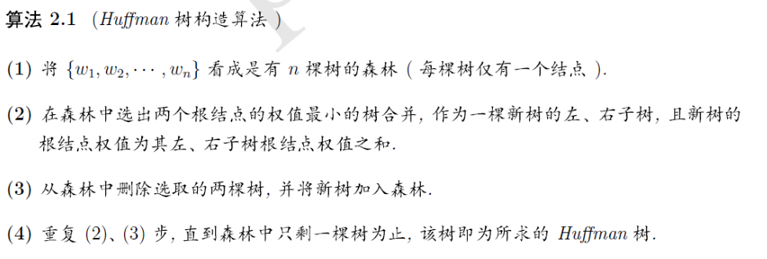

备注：

​	1、树根节点值为所有的叶节点的权重之和，所以huffman树可以看作从树根走到所有的叶节点的概率之和为1。如：走到最左下角的(8)，那么它的概率为$\dfrac{8}{8+6+5+3+1+15}=\dfrac{8}{38}$ 。

​	2、通常左节点的权值为较大值，右节点的权值为较小值。

​	3、体现出了权重越大(词频越大)的词，越接近树根，搜索距离越短。

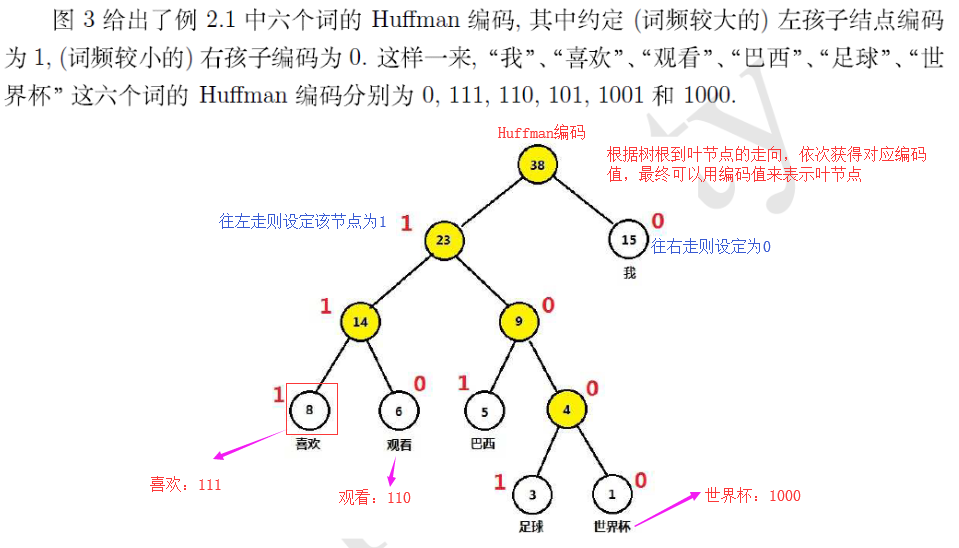

4、**统计语言模型：**

​	语言模型：从前面的单词，推断出接下来的单词，然后生成一句话。

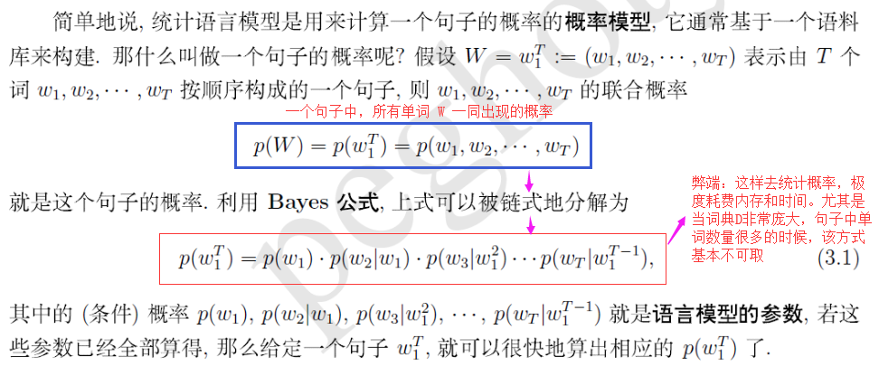

​	1、**N-gram模型**

**备注**：通常为了防止分母为0，要进行**平滑处理**。 

​	2、**神经网络模型**

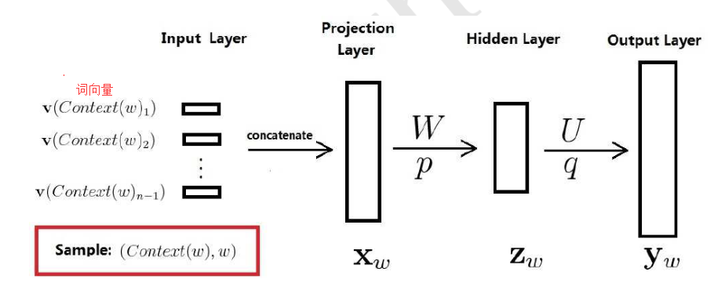

​	传统的统计模型中，如果语料库里有$S_1$ = "A dog is running in the room." 出现了10000次，而$S_2$ =“A cat is running in the room.”只出现了一次，那么在n-gram语言模型里，则会判定p(S1) >> p(S2)。但本质这句话的语义和语法上都是极度相似的，dog和cat在句子中扮演的是相同的角色。因此p(S1)和p(S2)本应该相似。

​	词向量的出项，解决了上述问题。

​	基于词向量的模型还不需要进行平滑处理，而ngram要进行平滑处理。

### word2vec的理解及算法原理

​	**理解**： 就是将所有的词都用同一个维度大小的向量去表示（即将词映射到一个n维的空间中，用相应的n维空间坐标来表示这个词。故此形象称为**词嵌入**）。词向量的表示方式可以很好的体现出 不同词语之间的相似性：如猫和狗，它们都是哺乳动物，四条腿，可做为宠物等等。

​	想使用神经网络模型还需要用到词向量，故此使用前还需要去训练出词向量。训练词向量的方法主要有两个：**CBOW模型**和**Skip-gram模型。** 在这两个模型的算法实现里又可以分为两种方法，一种是**基于Huffman softmax的模型** ，即层次softmax模型；另一种是**基于Negative Sampling的模型** ，即负采样模型。

CBOW模型是根据上下文的词来推出词w的概率，故此我们的目标就是使得  $p(w|Context(w))$ 概率最大，故通过对数极大似然可以得到我们的优化目标函数：

Skit-gram模型是由词w，产生上下文词的概率$p(Context(w)|w)$ ，使其最大化，故对数此然函数为：

为了方便后续公式，在这里贴出各符号意义：

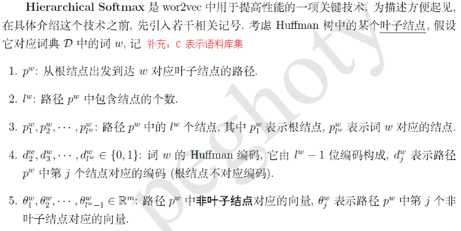

#### CBOW模型（Huffman softmax）

说是已知上下文词Context(w)，预测w。然后实际训练的是 所有上下文词**Context(w)的词向量**和**词W在Huffman树路径上的各参数$\theta_n $ **($\theta$的维度和词向量相同) 。而不是训练词w的词向量。

对于上图，要修改下各节点的概率计算规则，主要是根据Huffman的编码节点来修改，如下：

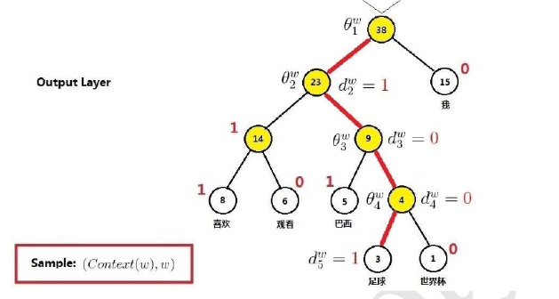

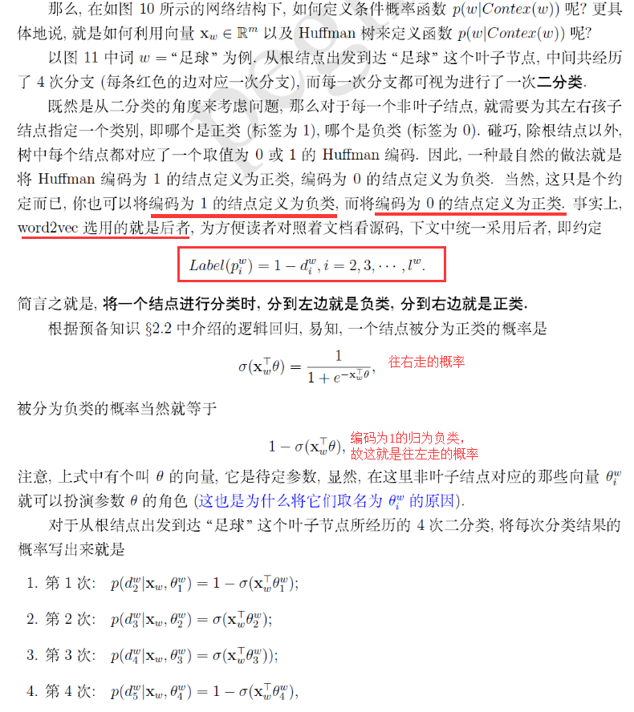

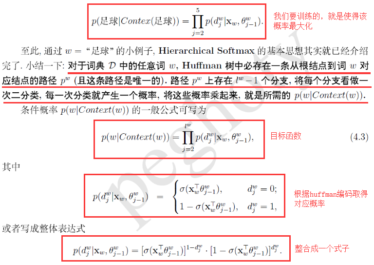

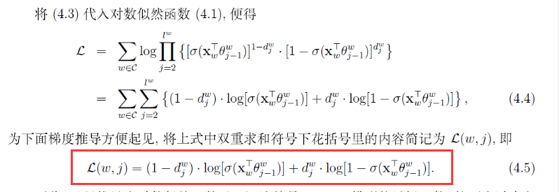

然后为概率最大化，所以用**梯度上升**的方法来更新参数：

**备注：** 对 v 的更新公式的意思：即 对每个上下文词的词向量都各自加上 $\eta*$sum(各个路径节点对$X_w$的偏导值)

也就是说，假设上下文共4各词，即4个对应的词向量，然后都做相同的更新。（还要留意下对x的偏导公式）

##### 注：我们可以发现，虽说是softmax，但其实我们是换成了n个节点的sigmoid二分类问题，然后求其概率连乘。

#### Skit-gram模型（Huffman softmax）

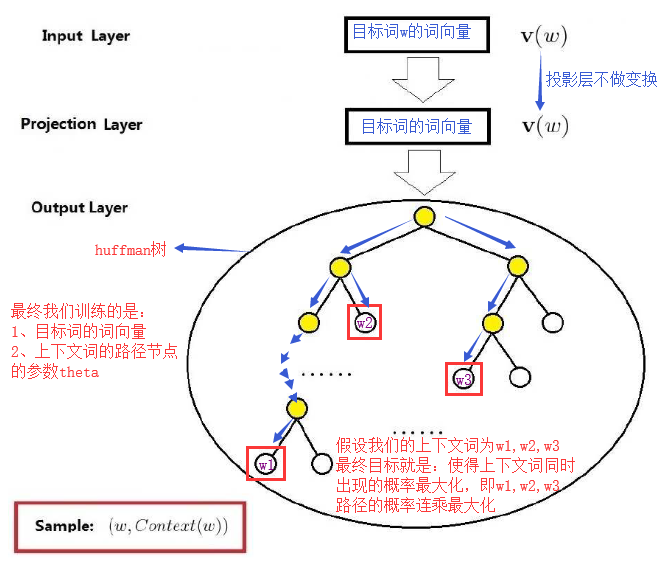

虽说是从目标词去推断上下文词，但最后训练的是目标测的词向量v(w)。

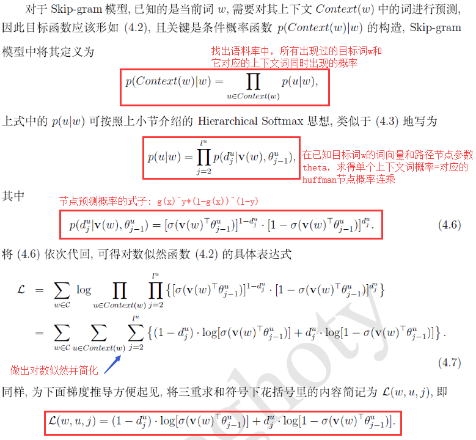

#### CBOW模型（Negative Sampling）

NEG不再采用huffman softmax树，而是直接取几个负样本，和目标词(正样本)组成一个小集合。同样不采用softmax进行多分类，而是多个二分类来对各自类别(词)进行预测概率（对应样本有各自的节点参数theta）。然后训练时，使得正样本(目标词)的概率变大，其它负样本的概率变小。

**因为不采用huffman树，所以没有节点d参数说法，预测为真的概率为g(x),而非(1-d)g(x)**

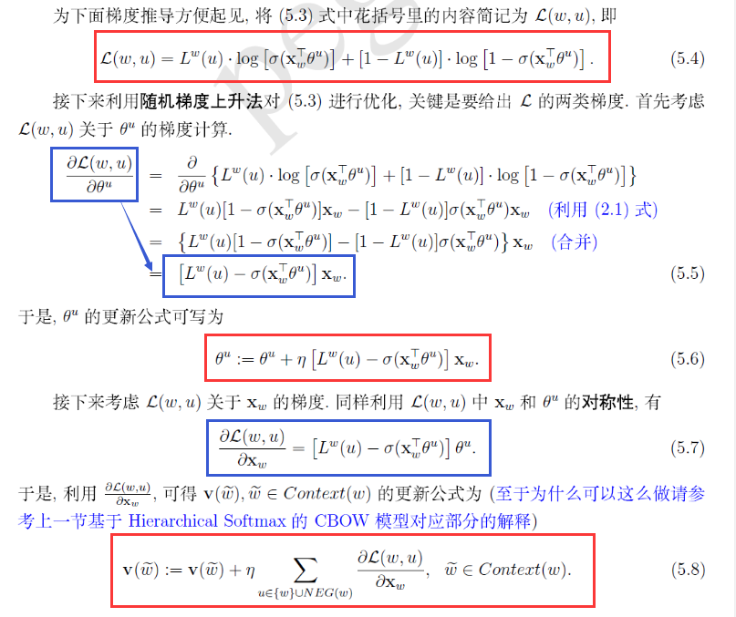

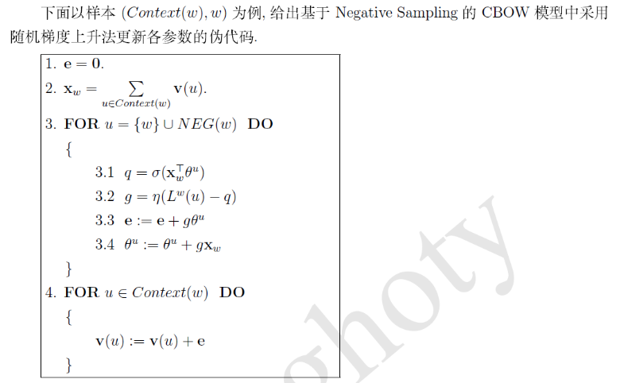

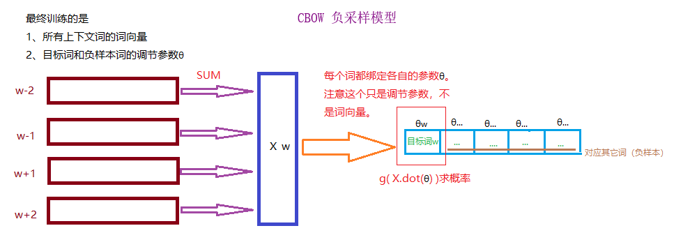

#### Skip-gram模型（Negative Sampling）

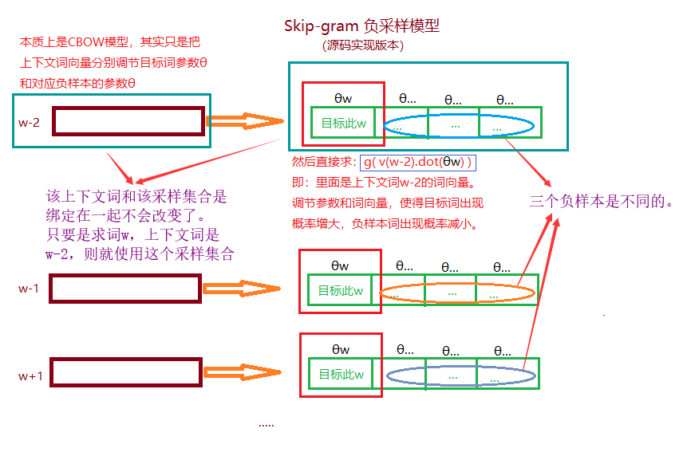

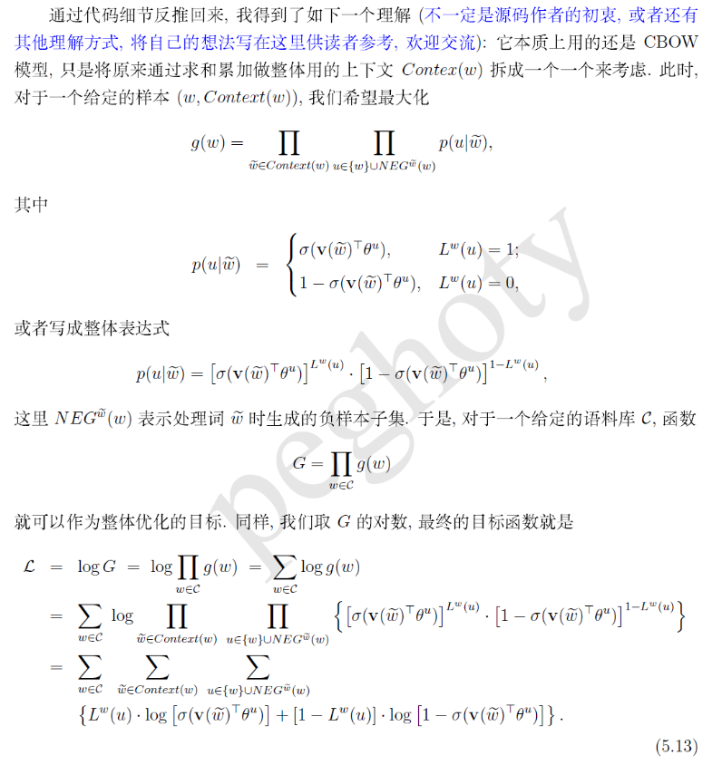

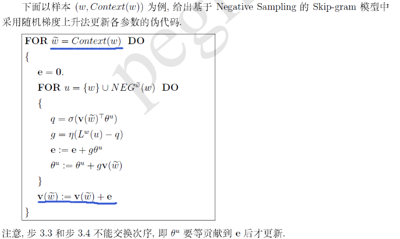

另外一种方式是非源码实现版本：

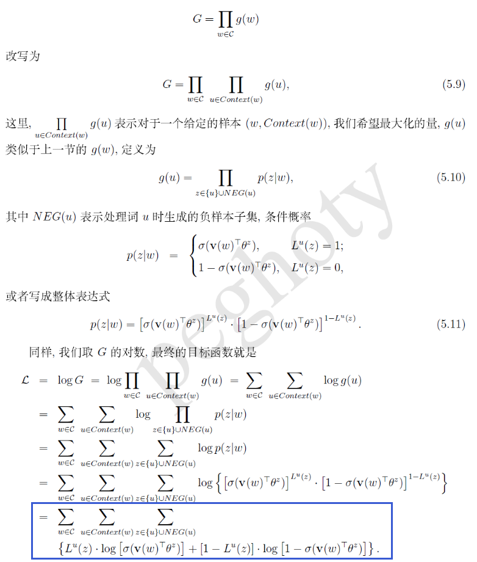

#### 负采样机制：

## 走进FastText：

fastText和CBOW_Huffman的关系：

​	1、从模型上讲，fastText的模型和CBOW Huffman模型基本一模一样。

​	2、fasttext的输入是文档的所有词，CBOW的输入是不好目标词的上下文词。

​	3、fasttext在huffman上的叶节点是不同类别的标签，CBOW的叶节点上是词典里的所有词

​	4、CBOW Huffman只是为了训练词向量word2vec，然后会把huffman数丢弃(即不需要那些节点上的调节参数θ)，最终只保留词向量。

​	5、fasttext训练完后，会保存词向量，也同时会保存模型，即保留huffman数的各节点参数θ。做预测测试时，先通过fasttext训练出来的词向量把输入文本转换为词向量矩阵，然后输入到模型中，根据huffman数的节点参数θ，去算出概率最大的 Label。

​	6、所以，**Fasttext不仅可以训练出词向量，也可以作为文本分类器模型**。

​	7、fastText的词向量和CBOW的词向量从意义上讲会有所不同。CBOW的词向量讲究的是上下文词和目标词之间的语义关系，从而训练出了各词之间语义关系。fastText的词向量讲究的是文本中不同的词组合和Label之间的关系程度，从而训练出了 词与词之间组合关系再映射到标签的关系，所以既体会出了词与词之间的关系，也体现出了不同词组合的文本与标签的关系。

